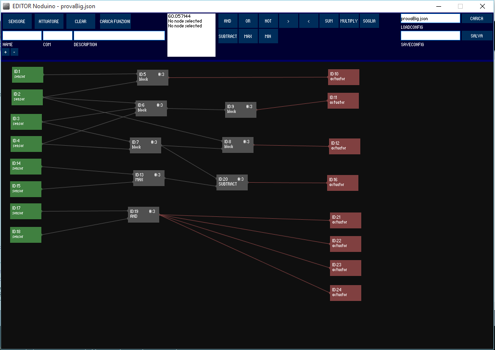

# pmmNode

#About
A suite made of :

  1.An editor for graphical-programming, uses [Processing](https://github.com/processing/processing)
  
  2.A nodeJS server.
  
  3.An arduino client.
  

#Screenshots

